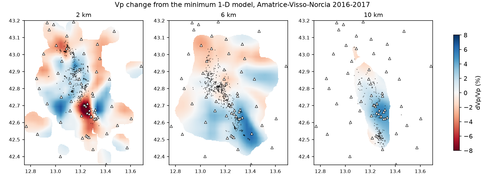
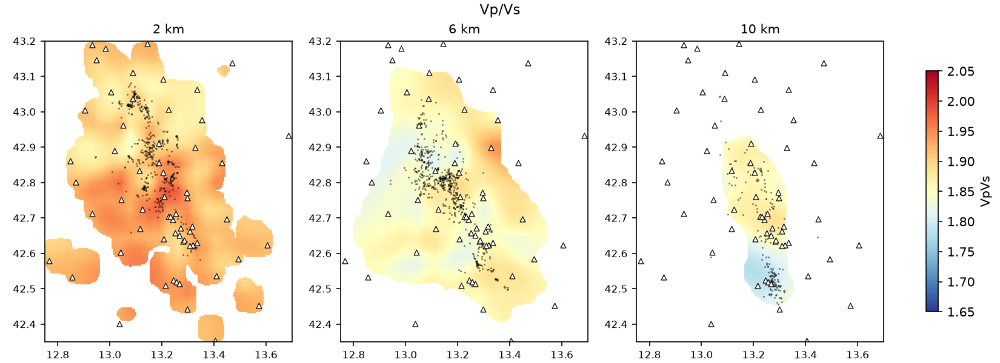
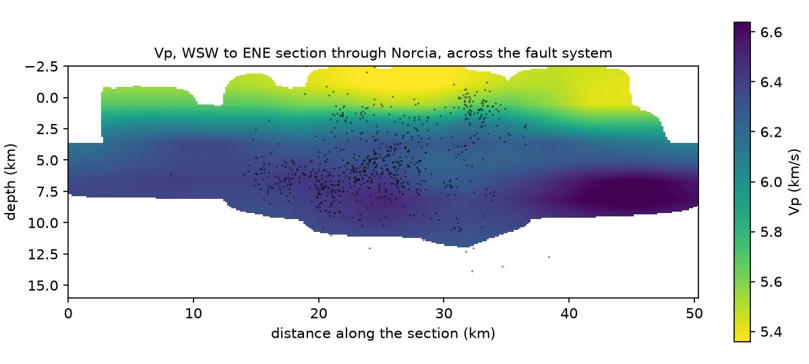
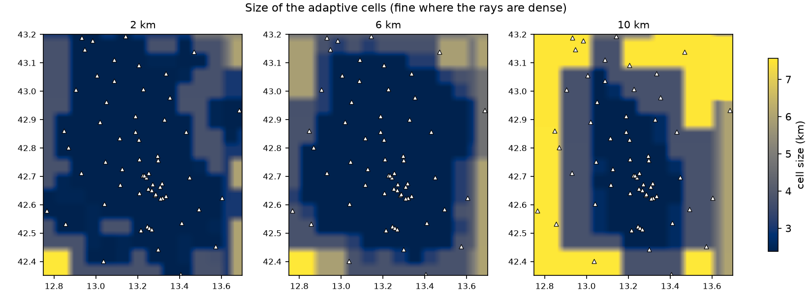
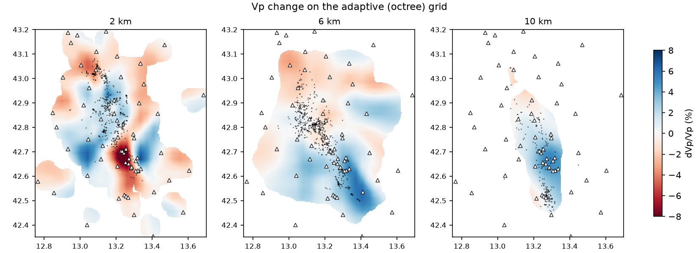
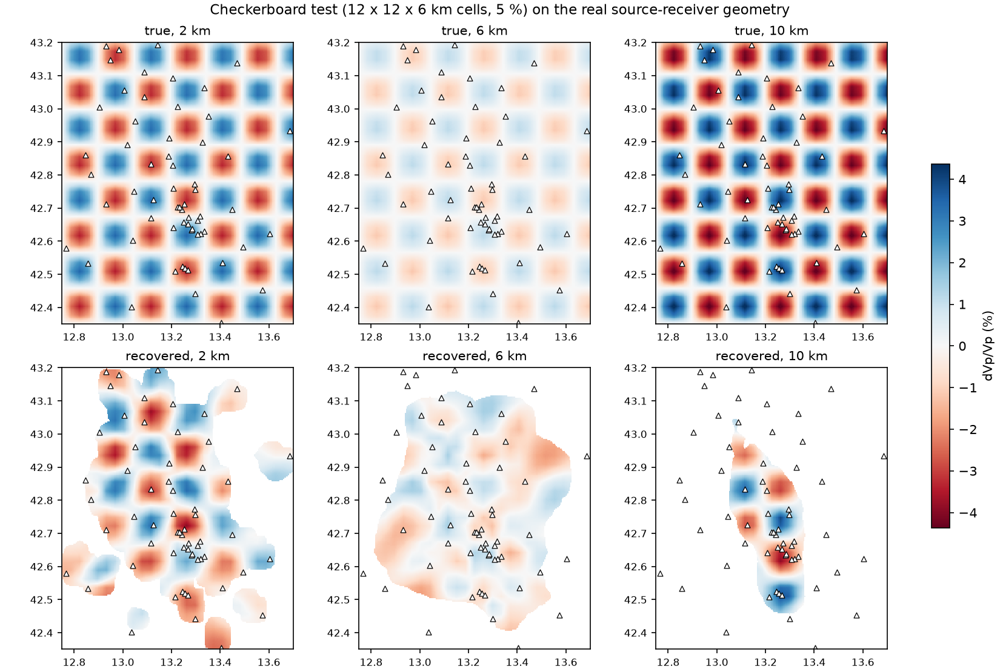
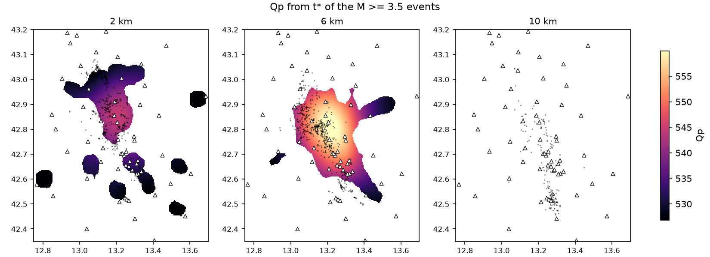
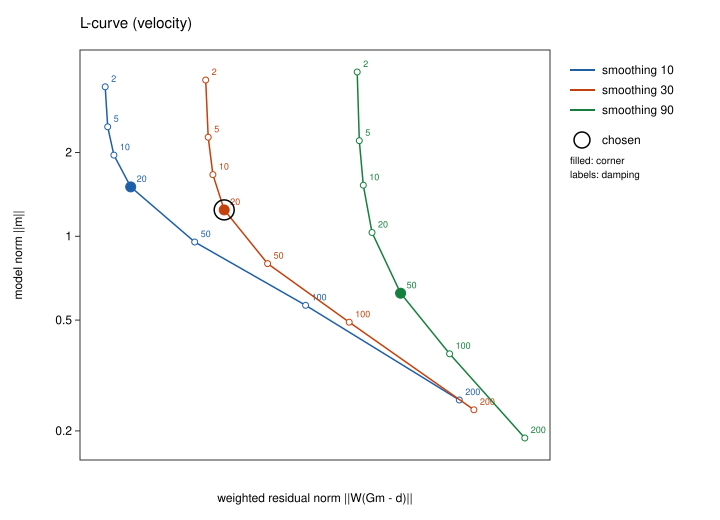

# TomoSTAR

[](https://doi.org/10.5281/zenodo.23188347)

**Seismic Travel-time and Attenuation tomogRaphy from the command line**

Matteo Mangiagalli - 2026
m.mangiagalli@campus.uniurb.it - ORCID [0009-0003-2031-8729](https://orcid.org/0009-0003-2031-8729)
Università degli Studi di Urbino - Carlo Bo

TomoSTAR is a standalone, cross-platform (Linux, macOS, Windows) command-line program for local and
regional earthquake tomography. It takes a network's stations, earthquakes and waveforms (or picks)
through the whole processing sequence:

1. automatic P and S picking (STA/LTA trigger and AIC onset),
2. hypocentre relocation (absolute, or double difference),
3. the grid and the 1-D starting profile, proposed from the data,
4. the minimum 1-D model,
5. Vp, Vs and Vp/Vs travel-time tomography jointly with hypocentres and station terms, on a regular
   or an adaptive (variable) grid, with curved rays from fast marching,
6. t\* measurement from displacement spectra and Qp or Qs attenuation tomography,
7. L-curves to choose damping and smoothing,
8. checkerboard, spike and tabular-body resolution tests,

and every step can be chained in a **script** that makes a study repeatable in one command. The
numerical kernels use the SIMD units of the processor (SSE, AVX2, AVX-512, NEON) through
`System.Numerics.Vector<T>` and, when an OpenCL device passes a self-test against the CPU solvers,
the GPU for the eikonal equation and for LSQR.

Input and output are plain text tables and the volume format of
[QUIVER](https://github.com/mattemangia/Quiver), the desktop workstation TomoSTAR derives from: a
QUIVER project can be read in place as the data, and the results can be registered back into it,
where they appear in QUIVER's 3-D viewer, sections and diagnostics.

## Contents

- [Building](#building)
- [Quick start](#quick-start)
- [The processing sequence](#the-processing-sequence)
- [Input data](#input-data)
- [Output](#output)
- [Working with QUIVER](#working-with-quiver)
- [Commands](#commands)
- [Configuration](#configuration)
- [Scripts](#scripts)
- [Methods](#methods)
- [Performance: SIMD, threads and OpenCL](#performance-simd-threads-and-opencl)
- [Optional MPI execution on HPC](#optional-mpi-execution-on-hpc)
- [A real example: the 2016-2017 central Italy sequence](#a-real-example-the-2016-2017-central-italy-sequence)
- [Tests and validation](#tests-and-validation)
- [Using the library](#using-the-library)
- [Repository layout](#repository-layout)
- [Citing](#citing)
- [License](#license)
- [References](#references)

## Building

TomoSTAR needs the [.NET 10 SDK](https://dotnet.microsoft.com/download). No other software is
required; an OpenCL runtime is used when present.

```bash
git clone https://github.com/mattemangia/TomoSTAR
cd TomoSTAR
dotnet build -c Release
dotnet test                                  # the test suite (about 10 s)
dotnet run --project src/TomoStar.Cli -c Release -- help
```

The executable is `src/TomoStar.Cli/bin/Release/net10.0/tomostar` (`tomostar.exe` on Windows). A
self-contained single file that runs on a machine without .NET is made with

```bash
dotnet publish src/TomoStar.Cli -c Release -r linux-x64 --self-contained -p:PublishSingleFile=true -o dist
```

(`-r osx-arm64`, `osx-x64`, `win-x64` or `linux-arm64` for the other platforms). In the rest of this
document `tomostar` stands for the executable.

Ready-made executables for these five platforms, and `TomoSTAR.app` for macOS, are attached to each
[release](https://github.com/mattemangia/TomoSTAR/releases). Double-clicking `TomoSTAR.app` opens a
Terminal window in which `tomostar` is ready; the application holds the Apple silicon and the Intel
executables and runs the one of the machine (it is built by `tools/make_macos_app.py`). The macOS
files are not notarised: run `xattr -dr com.apple.quarantine TomoSTAR.app` once after extracting.

## Quick start

The example in `examples/synthetic` makes a synthetic data set with a known answer (25 stations,
150 earthquakes, three-component waveforms, a checkerboard in Vp, Vs and 1/Q) and runs the complete
sequence on it, from the waveforms to the velocity and attenuation models and their resolution
tests:

```bash
tomostar run examples/synthetic/pipeline.tomo
```

It takes about a minute on a laptop and writes everything under `examples/synthetic/out`. The true
models are in `out/data/truth/*.qvol`, to be compared with the results (for example
`out/vel/volumes/vel_dVp.qvol`) in QUIVER, in ParaView (the `.vtk` files) or from the `.csv` files.
The script (`examples/synthetic/pipeline.tomo`) is commented line by line and is the best place to
see how the commands fit together.

A single command, for comparison, on data of your own:

```bash
tomostar grid mydata --out runs/grid                         # grid and 1-D profile from the data
tomostar invert mydata --grid runs/grid/grid.json --out runs/vel
```

where `mydata` is a folder with `stations.csv`, `events.csv` and `picks.csv` (see
[Input data](#input-data)) or a QUIVER project.

## The processing sequence

```
 waveforms (miniSEED)       stations, events (CSV, QuakeML, StationXML, QUIVER project)
        |                                  |
        +---------------> pick <-----------+         STA/LTA + AIC around predicted arrivals
                            |
                        relocate                      grid search + Levenberg-Marquardt Geiger
                            |
          grid  ------> minimum1d                     layered model, hypocentres, station terms
                            |
                         lcurve  ------------------>  damping and smoothing (L-curve corner)
                            |
                          invert                      Vp, Vs (or Vp/Vs), hypocentres, station terms
                            |
            +---------------+----------------+
            |               |                |
       resolution    relocate --method dd   tstar     checkerboard / spike / body tests;
                                              |       double difference in the 3-D model;
                                        lcurve --kind q   t* from P (and S) spectra
                                              |
                                            qtomo     Qp (or Qs) along the rays of the 3-D model
                                              |
                                          resolution --target Q
```

Every step writes a run folder whose tables are the input of the next step: `pick` writes
`stations.csv`, `events.csv` and `picks.csv`; `relocate` writes the same three with the new
hypocentres (and `events_relocated.csv`, `locations.csv` with the error ellipses); `invert` writes the
volumes, the relocated events and the station terms; `tstar` writes `tstar.csv`. A run folder can
therefore be given as the data of the next command.

## Input data

All tables are delimited text (comma, semicolon or tab, detected from the header). The first
non-comment line is the header; columns are found by name, without regard to case, in any order;
other columns are ignored. Lines starting with `#` are comments. Numbers use a dot as the decimal
separator. Times are UTC in ISO 8601 (`2016-10-30T06:40:17.32Z`), or seconds since 1970-01-01.

Coordinates are geographic degrees (WGS84 latitude used as geocentric, on a sphere of 6371 km),
depths are km below sea level (negative above), elevations m above sea level.

**stations.csv**

| column | meaning | required |
|---|---|---|
| `id` (or `network` + `station`, joined as NET.STA) | station identifier used by the picks | yes |
| `lon`, `lat` | position, degrees | yes |
| `elevation_m` (or `depth_km`) | elevation above sea level, m | no (0) |
| `correction_p_s`, `correction_s_s` | static corrections of an earlier run, s | no |

**events.csv**

| column | meaning | required |
|---|---|---|
| `id` | event identifier | yes |
| `time` | origin time, UTC | yes |
| `lon`, `lat`, `depth_km` | starting hypocentre | yes |
| `magnitude` | used by the t\* measurement to bound the corner frequency | no |
| `fixed` | 1 to hold the hypocentre (shots, blasts) | no |

**picks.csv**

| column | meaning | required |
|---|---|---|
| `event`, `station` | identifiers from the two tables above | yes |
| `phase` | P or S; Pg, Pn, Pb, Sg, Sn, Sb are read as P or S, later phases (PmP, pP...) are skipped | yes |
| `time` | absolute arrival time, UTC | one of the two |
| `travel_time_s` | seconds after the origin time of events.csv | one of the two |
| `sigma_s` | one-sigma pick uncertainty (default 0.1 s for P, 0.2 s for S) | no |
| `quality` | HYPO71 class 0 to 4 (4 = not used) | no |
| `origin` | `manual`, `catalog` or `automatic` (see below) | no |
| `disabled` | 1 to leave the pick out | no |

When a station has several picks of one phase for an event, the inversion keeps one: a manual pick
first, then a catalogue pick, then an automatic one, and among equals the smallest uncertainty.
Automatic picks are used only for events with fewer than 8 analyst picks unless
`AutomaticPicks` is `Always` (see [Configuration](#configuration)).

**tstar.csv** (for the Q tomography; written by `tomostar tstar`)

| column | meaning | required |
|---|---|---|
| `event`, `station` | identifiers | yes |
| `tstar_s` | t\* = integral of ds / (v Q) along the ray, s | yes |
| `phase` | P (default) or S | no |
| `sigma_s` | uncertainty (default 5 ms) | no |
| `disabled` | 1 to leave the measurement out | no |

**Other formats.** `--quakeml FILE` adds the events and picks of a QuakeML 1.2 file (the preferred
origin, and the picks its arrivals associate); `--stationxml FILE` adds stations and, at response
level, the instrument responses used by the t\* measurement. Both options may be repeated.

**1-D models** are given by name from the built-in library of published models (`tomostar model1d
--list`: ak135, iasp91, PREM and regional models, each with its reference and DOI), as a text file of
`depth_km vp vs` lines (a repeated depth is a discontinuity), or as `auto`, the published model that
suits the grid area best.

**Waveforms** (for `pick` and `tstar`) are miniSEED 2.4 files. The quickest layout is a folder per
event, `WAVEFORMS/<event id>/*.mseed` (any file names; the synthetic data sets use it). Any other
arrangement of miniSEED files under `--waveforms` also works: the files are indexed once and the
segments overlapping each event's time window (`Waveforms.BeforeSeconds`, `AfterSeconds`) are read.
The waveforms of a QUIVER project are found through its catalogue.

## Output

Each command writes a run folder (`--out DIR`, default `runs/<date_time>_<command>`); the run name
(`--name`, default the folder name) prefixes the volume files. A velocity run contains:

| file | content |
|---|---|
| `volumes/<run>_Vp.qvol`, `_Vs`, `_VpVs` | final velocities and ratio |
| `volumes/<run>_dVp.qvol`, `_dVs`, `_dVpVs` | change from the starting model, % |
| `volumes/<run>_DWS_P.qvol`, `_DWS_S`, `_Hits_P`, `_Hits_S` | derivative weight sum (km of ray) and ray count per node |
| `volumes/<run>_CellSize.qvol`, `mesh.json` | cell size and cells of an adaptive run |
| `volumes/*.csv`, `*.vtk` | the same volumes as text or VTK (`OutputFormats`, `--formats`) |
| `summary.json` | settings, grid, statistics of every iteration, warnings |
| `iterations.csv` | RMS, variance reduction, LSQR iterations and stop reason, step length per iteration |
| `residuals.csv` | every arrival: distance, azimuth, initial and final residual, rejection and its reason |
| `hypocentres.csv`, `events_relocated.csv` | starting and final hypocentres; the latter is an event table |
| `stations.csv` | station terms and mean residuals |
| `rays.qray` | the final rays (binary, readable by QUIVER) |
| `G.qcsr`, `G.layout.json` | the last linear system (sensitivity matrix) and its column layout |
| `log.txt` | everything printed during the run |

`minimum1d` adds `model1d_minimum.txt`, usable as `--model`. `lcurve` writes `lcurve.csv` (every
damping and smoothing pair with its residual norm, model norm, roughness, data and model variance),
`lcurve.svg` (the curves, their corners and the recommended pair) and the recommendation in
`summary.json`. `resolution` writes the true, recovered and difference volumes, the DWS and the
correlations. `qtomo` writes `Qp` (or `Qs`), `1000_over_Qp`, `DWS_Q` and `station_terms.csv`. `grid`
writes `grid.json`, `advice.txt` (every choice and its reason), `profile1d.csv` (the 1-D model at the
grid depths), `model1d.txt`, the starting volumes and a `config.json` to start from.

**Volume format.** A `.qvol` file is the QUIVER volume: an 8-byte magic `QVOL\x01\0\0\0`, a
little-endian int32 header length, a UTF-8 JSON header (name, quantity, units, grid definition,
provenance), zero padding to a 64-byte boundary, then Nx x Ny x Nz little-endian float32 values with
longitude fastest and depth slowest; NaN marks no data. Node i of Nx is at
`MinLon + i (MaxLon - MinLon) / (Nx - 1)`, and the same for latitude and depth. The CSV export has the
header `lon,lat,depth_km,value` preceded by `# QUIVER volume: ...` comment lines; the VTK export is a
legacy binary STRUCTURED_GRID in km in a local east, north, up frame (the true curved geometry),
with longitude, latitude and depth as extra point scalars. `tomostar export` converts any `.qvol`.

## Working with QUIVER

**Reading a project.** Give the project folder (`study.quiver`, or its `project.json`) as the data:

```bash
tomostar invert /path/to/study.quiver --out runs/vel
```

TomoSTAR then reads, without QUIVER and without changing the project:

- `stations.json`: the stations and their corrections;
- `catalog.sqlite` (opened read-only): events (starting from QUIVER's relocation when there is one,
  or from the catalogue location with `--catalog-locations`), picks with their uncertainty, quality,
  origin and disabled flag, t\* measurements and waveform references;
- `project.json`: the grid, the starting model, the tomography and attenuation settings and the rule
  for data outside the grid. These become the defaults of the run; a configuration file and `--set`
  still override them (see [Configuration](#configuration)).

**Writing into a project.** `--register PROJECT` (or `--register data` when the project is the data)
copies the run folder into the project's `runs` folder, where QUIVER's Diagnostics tab lists it
(RMS per iteration, LSQR convergence, residuals, rays, sensitivity), copies the volumes into its
`volumes` folder and adds them to the volume list of `project.json`, so they appear in the project tree
the next time the project is opened. Close the project in QUIVER before registering: QUIVER writes its
own list back when it saves. `project.json` is backed up as `project.json.bak` first. An existing run
folder can be registered later with `tomostar register RUN --project PROJECT`.

**Importing by hand.** Every `.qvol`, `.csv` and `.vtk` volume TomoSTAR writes can also be opened with
QUIVER's File, Import volume.

`examples/quiver/quiver_project.tomo` runs an L-curve, a tomography, a checkerboard test and a Q
tomography on a QUIVER project and registers the results in it.

## Commands

`tomostar help` lists the commands and the options they share; `tomostar help COMMAND` shows the
usage of one. The first word after the command, when it is not an option, is the data (`--data`).

| command | what it does | main options |
|---|---|---|
| `synth` | synthetic data set with a known answer | `--with-waveforms`, `--events`, `--stations`, `--seed`, section `Synthetic` |
| `grid` | grid and 1-D profile from the data, or from `--bounds` | `--h`, `--dz`, `--margin`, `--top`, `--bottom`, `--bounds LON1,LON2,LAT1,LAT2`, `--model` |
| `model1d` | list, show, export, choose (`--area`) or sample (`--grid`) a 1-D model | `--list`, `--out`, `--area`, `--grid`, `--profile` |
| `pick` | STA/LTA and AIC picks around the predicted arrivals | `--waveforms`, `--only-automatic`, section `Picker` |
| `relocate` | absolute or double-difference relocation in a 1-D or 3-D model | `--method absolute|dd`, `--fix-depth`, `--vp`, `--vs`, sections `Locator`, `Tomography.DoubleDifference` |
| `minimum1d` | minimum 1-D model | `--iterations`, `--damping`, `--smoothing` |
| `invert` | Vp, Vs (or Vp/Vs) tomography with hypocentres and station terms | `--iterations`, `--damping`, `--smoothing`, `--adaptive`, `--layered`, section `Tomography` |
| `lcurve` | trade-off curves and recommended regularisation | `--kind velocity|q`, `--dampings`, `--smoothings`, `--save-models`, `--update-config FILE` |
| `resolution` | checkerboard, spike and body tests | `--pattern`, `--target Vp|Vs|VpVs|Leakage|Q|QLeakage`, `--cell`, `--cell-depth`, `--amplitude`, `--spike`, `--body`, `--seed` |
| `tstar` | t\* from P (and S) displacement spectra | `--waveforms`, `--stationxml`, section `TStar` |
| `qtomo` | Qp or Qs tomography | `--vp`, `--vs`, `--damping`, `--smoothing`, `--phase`, section `Attenuation` |
| `export` | `.qvol` to CSV or VTK | `--csv`, `--vtk`, `--out` |
| `register` | add a run folder to a QUIVER project | `--project`, `--name` |
| `config` | effective configuration, or `--template` | `--template --out FILE` |
| `info` | version, SIMD width, OpenCL devices and self-tests | |
| `run` | run a script | `--var NAME=value`, `--dry-run`, `--keep-going` |

Options every command accepts:

| option | meaning |
|---|---|
| `--data PATH` | folder of tables, or a QUIVER project |
| `--stations`, `--events`, `--picks`, `--tstar` | single tables, replacing those of `--data` |
| `--quakeml`, `--stationxml` | add QuakeML events and picks, StationXML stations and responses |
| `--hypocentres FILE` | an event table whose hypocentres replace those of the same events |
| `--grid FILE` | `grid.json` or a QUIVER project; otherwise the configuration's, the `--vp` volume's, or one proposed from the data |
| `--model M` | the 1-D starting and background model |
| `--vp FILE --vs FILE` | a 3-D model (`.qvol`, resampled when on another grid); Vs from the 1-D Vp/Vs when only `--vp` |
| `--config FILE`, `--set Path=value` | configuration file and overrides |
| `--out DIR`, `--name NAME` | run folder and run name |
| `--formats csv,vtk`, `--csv`, `--vtk` | volume formats besides `.qvol` |
| `--register PROJECT` | copy the results into a QUIVER project |
| `--adaptive` | adaptive octree parameterisation (velocity and Q) |
| `--straight` | straight rays instead of fast marching |
| `--no-opencl`, `--threads N` | CPU only; number of threads (0 = all) |
| `--mpi` | enable MPI forward workers; pass once on the top-level command, including before `run` |
| `--quiet`, `--keep-work` | print nothing; keep the travel-time tables in `work/` |

Exit codes: 0 success, 1 error, 2 command-line mistake, 130 interrupted (Ctrl+C stops at the next
checkpoint).

## Configuration

Every setting lives in one JSON document. A command starts from the defaults and applies, in order:

1. the settings of a QUIVER project given as data (grid, starting model, tomography and attenuation
   settings, outside-data rule, OpenCL);
2. the configuration file, `--config FILE`;
3. each `--set Path=value`, for example `--set Tomography.Smoothing=30`,
   `--set Tomography.Adaptive.Enabled=true`, `--set LCurve.Dampings=[1,10,100]`;
4. the explicit options of the command (`--damping`, `--smoothing`, `--iterations`...).

`tomostar config --template --out tomostar.json` writes the whole document with its defaults;
`tomostar config DATA --config FILE --set ...` prints the configuration a command would run with.
Comments (`//`) and trailing commas are allowed in the file. Relative model paths in a configuration
file are relative to the file.

| section | what it controls |
|---|---|
| `Grid` | the inversion grid (`MinLon`, `MaxLon`, `MinLat`, `MaxLat`, `MinDepthKm`, `MaxDepthKm`, `Nx`, `Ny`, `Nz`); null to propose one |
| `GridAdvice` | what the grid proposal may not choose: spacings, margin, top, bottom |
| `StartingModel` | library name, file, `auto`, or `quiver` (the project's model) |
| `OutsideData` | `Exclude`, or `WhenRaysCross`: events and stations outside the grid are used when their rays cross it, on an enlarged forward grid with the 1-D model outside |
| `MinPhasesPerEvent`, `AutomaticPicks` | data selection |
| `UseOpenCl`, `Threads`, `OutputFormats` | computing and output |
| `Tomography` | velocity inversion: `Iterations`, `InvertP`, `InvertS`, `Parameterization` (`VpVs` or `VpVpVs`), `JointHypocentres`, `StationCorrections`, `DampingVelocity`, `Smoothing`, `SRegularisationFactor`, `SmoothingMethod` (`Laplacian`, `Gradient`, `TotalVariation`, `EdgePreserving`), `VerticalSmoothingWeight`, `SmoothingScale`, `RayMethod`, `ForwardRefinement`, `MaxSlownessStep`, `MaxStepHalvings`, outlier rules, velocity bounds, `StartVpVs` (`FromModel`, `FromData` from the Wadati diagram, `Constant`), and the subsections `Adaptive`, `Lattice` and `DoubleDifference` |
| `Attenuation` | Q inversion: `Phase`, `Q0`, `EstimateQ0`, `Damping`, `Smoothing`, `StationTerms`, `DampingStation`, `SmoothingMethod`, `Adaptive`, `Lattice`, Q bounds. Damping and smoothing are relative to the typical sensitivity of the t* to each parameter, so the same values hold whatever the background Q and the t* errors |
| `Locator` | absolute location: grid search, Geiger iterations and damping, outliers, `FixDepth` |
| `Relocation` | `Method`: `absolute` or `dd` |
| `Picker` | filter band, STA and LTA lengths, trigger threshold, search window, `PickS`, `MinSnr` |
| `TStar` | `Method` (`SingleTaper` or `MultitaperJoint`), windows, frequency band, SNR, corner-frequency search and stress-drop bounds, frequency-dependent Q, S t\* |
| `LCurve` | the damping and smoothing values tried, `SaveModels` |
| `Resolution` | pattern, target, cell sizes, amplitude, spikes, bodies, noise, seed |
| `Waveforms` | seconds read before and after the origin time |
| `Synthetic` | the synthetic data set |

**Variable grid.** `--adaptive` (or `Tomography.Adaptive.Enabled`) replaces the node unknowns by the
leaves of an octree over the grid, refined where the rays are dense and coarse where they are few,
rebuilt from the coverage of every iteration (`MaxCellNodes`, `MaxCellNodesDepth`, `Threshold`,
`Coverage` = `Hits` or `Dws`, `Balance`, `RefineEachIteration`, `AllowCoarsening`). The forward
problem and the output stay on the grid; `CellSize` shows the cells. A rotated and shifted
parameter lattice (`Tomography.Lattice`) is the other alternative to the nodes.

## Scripts

A script is a text file of TomoSTAR commands, one per line, written as at the prompt without the
word `tomostar`, plus a few statements that make a sequence of runs reproducible:

| statement | meaning |
|---|---|
| `set NAME = value` | define a variable, used as `${NAME}` |
| `default NAME = value` | define it only if not defined yet (so `run --var NAME=...` wins) |
| `config FILE` | configuration file of the following commands (`config none` to clear) |
| `options --opt value ...` | options added to every following command (`options none` to clear) |
| `echo TEXT` | print a message |
| `include FILE` | run another script here, sharing the variables |
| `foreach NAME in A B C` ... `end` | repeat the enclosed lines for each value |
| `if exists PATH` ... `end` | run the enclosed lines only if the file or folder exists |
| `if missing PATH` ... `end` | run them only if it does not (to skip steps already done) |
| `exit` | stop here |

Before a line runs, `${NAME}` is replaced by a variable, `${env:NAME}` by an environment variable
and `${json:FILE:Path.To.Value}` by a value read from a JSON file, typically a result of an earlier
step: `${json:${OUT}/lcurve/summary.json:Recommended.Damping}` is the damping the L-curve chose.
A line ending with `\` continues on the next; `#` starts a comment line; quotes group words. A
command line starting with `-` may fail without stopping the script; otherwise the first failure
stops it (or not, with `--keep-going`). Relative paths are relative to the folder of the script.
The variables `SCRIPT_DIR`, `CALLER_DIR`, `DATE` and `TIME` are predefined.

```bash
tomostar run study.tomo --var OUT=/data/runs/2026 --var DATA=/data/picks
tomostar run study.tomo --dry-run          # print the expanded commands only
```

A short example: choose the regularisation, invert, and test the result.

```
default OUT = runs
config study.json
options --grid grid.json --model minimum1d.txt

lcurve  ${DATA} --out ${OUT}/lcurve
set D = ${json:${OUT}/lcurve/summary.json:Recommended.Damping}
set S = ${json:${OUT}/lcurve/summary.json:Recommended.Smoothing}
invert  ${DATA} --damping ${D} --smoothing ${S} --out ${OUT}/vel --name vel
foreach CELL in 10 15 20
  resolution ${DATA} --vp ${OUT}/vel/volumes/vel_Vp.qvol --vs ${OUT}/vel/volumes/vel_Vs.qvol \
             --set Tomography.DampingVelocity=${D} --set Tomography.Smoothing=${S} \
             --cell ${CELL} --out ${OUT}/checker_${CELL}
end
```

`lcurve --update-config FILE` is the other way to pass the choice on: it writes the recommended
damping and smoothing into a configuration file used by the following commands.

## Methods

**Geometry.** Every position is handled on a sphere of radius 6371 km: grids are regular in
longitude, latitude and depth, and every distance, ray segment and spacing is computed in true
spherical geometry, so a 1 km survey and a 1000 km deep model use one set of formulas. Grids across
the antimeridian are supported.

**Forward problem.** First-arrival travel times are computed for every station (by reciprocity) on
a forward grid finer than the inversion grid (`ForwardRefinement`), by solving the eikonal equation
in spherical coordinates with the fast marching method (Sethian 1996; Sethian and Popovici 1999)
using the Godunov upwind scheme (Rouy and Tourin 1992), second order where possible, with the
near-source nodes initialised analytically. On an OpenCL device the same update is iterated with the
parallel fast sweeping method (Zhao 2005; Detrixhe et al. 2013); devices without double precision
hold each time as a pair of floats. Travel-time tables are stored as memory-mapped files and reused
when the model has not changed. Rays are traced back from the source along the gradient of the
travel-time field (e.g. Rawlinson and Sambridge 2004), and each ray is integrated against the
trilinear basis of the inversion grid to form its row of the sensitivity matrix. Straight rays are
available for tests. Stations and events outside the inversion grid can be used when their rays
cross it: the forward grid is enlarged and holds the 1-D model outside.

**Travel-time tomography.** The coupled velocity and hypocentre problem (Aki and Lee 1976; Thurber
1983) is solved by damped, smoothed least squares at every nonlinear iteration with LSQR (Paige and
Saunders 1982): unknowns are fractional slowness changes of P and S (or of P and of Vp/Vs, after
Thurber 1993), the four hypocentral parameters of every event and, optionally, P and S station terms
with zero sum. Smoothing penalises the roughness of the total deviation from the starting model, not
of each update, with second differences in km (so node spacing does not favour horizontal
structure) and a vertical weight; gradient, total-variation (Rudin et al. 1992) and edge-preserving
(Perona and Malik 1990) penalties are also available. Each step is shortened when it would change
any slowness by more than `MaxSlownessStep`, and halved when it increases the weighted misfit.
Outliers are rejected on robust (MAD) statistics after removing each event's median residual. The
minimum 1-D model (Kissling et al. 1994) is the same inversion with one velocity per layer. Double
differences of neighbouring events (Waldhauser and Ellsworth 2000; Zhang and Thurber 2003) can be
inverted with the absolute times, with the weighting schedule of tomoDD.

**Regularisation choice.** The L-curve (Hansen 1992) and the data-variance/model-variance trade-off
(Eberhart-Phillips 1986) are computed from the first linearised step for every damping and smoothing
pair (for Q, from the complete linear inversion). For each smoothing the damping at the point of
maximum curvature of log residual norm against log model norm is found; the corners of the
different smoothings form a second curve (misfit against roughness) whose corner gives the smoothing.

**Resolution tests.** A checkerboard (smooth sine cells), Gaussian spikes or tabular bodies of any
strike and dip (Spakman and Nolet 1988; Humphreys and Clayton 1988) are added to the model, synthetic
data are computed for the same source-receiver geometry with the same forward solver, Gaussian noise
is added, and the data are inverted with the same settings. The tests cover Vp, Vs, Vp/Vs, the leakage
of Vp and Vs structure into Vp/Vs, 1/Q, and the leakage of velocity errors into 1/Q; the correlation
between true and recovered patterns is reported over the sampled and the well-sampled nodes (derivative
weight sum, Toomey and Foulger 1989).

**Picking.** The recursive STA/LTA (Allen 1978) gives the candidate arrivals in a window around the
arrival the model predicts (wider at larger travel times; `Picker.WindowSeconds` and
`Picker.WindowPerSecond`); of the candidates at least half as strong as the strongest, the one nearest
the predicted time is kept, so that the coda or the arrival of another earthquake earlier in the
window is not taken during a sequence. The onset is refined with the AIC picker (Maeda 1985); the
quality class and uncertainty follow the signal-to-noise ratio. P is picked on the vertical, S on the
energy of the horizontals, after the P pick.

**Location.** Each event is located by a grid search on the travel-time tables (L1 misfit with the
weighted-median origin time; after Lomax et al. 2000), refined by Geiger's method (Geiger 1912) as a
Levenberg-Marquardt iteration that accepts a step only when it lowers the misfit; the error ellipse,
depth and origin-time errors come from the scaled covariance, and outliers are rejected on robust
statistics. The double-difference relocation solves all events at once in the 3-D model with the
tomography engine and its velocities held fixed.

**t\* and Q.** Displacement spectra are modelled as a Brune (1970) source times exp(-pi f t\*). The
single-taper method searches one corner frequency per event and fits ln Omega0 and t\* per record
(Eberhart-Phillips and Chadwick 2002); the multitaper method (Thomson 1982) inverts the records of an
event jointly with a shared source level and optional frequency-dependent Q (Stachnik et al. 2004;
Wei and Wiens 2018). Noise power is removed, the corner search is bounded by the magnitude through a
stress-drop range, and events whose corner trades off with t\* are flagged. The Q tomography is
linear in 1/Q along the rays of the velocity model, t\* = sum of L s q (e.g. Rietbrock 2001), with a
reference Q estimated from the data, optional station terms, and the same regularisation and
parameterisations as the velocity inversion.

## Performance: SIMD, threads and OpenCL

- The dense vector operations of LSQR (dot products, norms, axpy) use `System.Numerics.Vector<T>`, the
  widest SIMD unit of the machine (SSE, AVX2 or AVX-512 on x64, NEON on ARM64 and Apple silicon),
  without platform-specific code. Sparse products are row-parallel; the transpose is stored, so the
  results do not depend on the number of threads.
- Travel-time tables, ray tracing, row assembly, relocation, picking and t\* run on all cores
  (`--threads N` to limit them).
- With an OpenCL device (GPU), the eikonal tables are computed on the device in batches while the
  CPU cores take tables from the other end of the queue, and LSQR runs entirely in device memory.
  A device is used only after it has solved a test problem and agreed with the CPU solver; any
  failure falls back to the CPU. `tomostar info` shows the SIMD width, the devices and the self-tests;
  `--no-opencl` forces the CPU.

On a four-core laptop CPU without a GPU, the whole synthetic example (25 stations, 150 events,
7500 picks, every step from picking to Q resolution tests) runs in about 45 s.

## Optional MPI execution on HPC

Normal execution on Linux, Windows and macOS is unchanged: **MPI is optional**, and neither MPI
nor its native wrapper is loaded or required unless `--mpi` is passed. The standard build and
self-contained publish commands above continue to work without an MPI installation. MPI execution
is initially targeted and tested on Linux; normal macOS/Windows execution does not use this path.

With `--mpi`, rank zero runs the command or script, assembles the inversion, solves LSQR and writes
all final outputs. The other ranks wait for forward requests. Travel-time tables and ray tracing
are partitioned by station, with CPU threads and optional OpenCL within each rank. Standalone
travel-time table generation, including picking and absolute relocation, also distributes its
tables. Picking, event location, spectral estimation and other command processing remain on rank
zero. **LSQR and the sensitivity matrix are not distributed**: rank-zero RAM still limits the
inversion size. This is a first MPI implementation for accelerating the forward calculation.

Build the small native wrapper against the same MPI implementation used by the cluster launcher:

```bash
dotnet build -c Release
bash native/mpi/build.sh "$PWD/mpi-native"
export LD_LIBRARY_PATH="$PWD/mpi-native${LD_LIBRARY_PATH:+:$LD_LIBRARY_PATH}"

mpirun -np 4 src/TomoStar.Cli/bin/Release/net10.0/tomostar --mpi invert mydata \
  --grid runs/grid/grid.json --out runs/mpi-vel --threads 8 --no-opencl

# Only rank zero interprets the script, including file checks and output registration.
mpirun -np 4 src/TomoStar.Cli/bin/Release/net10.0/tomostar --mpi run study.tomo
```

`mpicc` and `mpirun` are needed for this optional path. The wrapper is a separate
`libtomostar_mpi.so`, also needed alongside an MPI-enabled self-contained deployment; it is not
included automatically by `dotnet publish`. Recompile it when switching MPI implementations.
Pass `--mpi` on the top-level invocation, rather than in individual script lines. Launching
multiple ranks without `--mpi` is rejected when standard OpenMPI/PMI launcher variables identify
the parallel run, to prevent accidental concurrent writes.

All ranks need access to the **same writable run/work directory at the same absolute path**.
Per-rank ray workers use `work/mpi-rank-N`; standalone table workers write disjoint station files
under the shared table directory. Scratch is removed by rank zero after workers finish unless
`--keep-work` is used. Errors reported by a worker are collected before rank zero fails the
command. Cancellation is checked before and after each distributed forward request; a running
request finishes before a graceful cancellation takes effect. For immediate termination use the
cluster scheduler's job cancellation.

For Slurm, an illustrative CPU allocation is:

```bash
#!/bin/bash
#SBATCH --job-name=tomostar
#SBATCH --nodes=2
#SBATCH --ntasks-per-node=1
#SBATCH --cpus-per-task=8
#SBATCH --time=01:00:00

export LD_LIBRARY_PATH="$PWD/mpi-native${LD_LIBRARY_PATH:+:$LD_LIBRARY_PATH}"
srun src/TomoStar.Cli/bin/Release/net10.0/tomostar --mpi invert mydata \
  --grid runs/grid/grid.json --out runs/mpi-vel \
  --threads "$SLURM_CPUS_PER_TASK" --no-opencl
```

Adjust partition, memory, binding and MPI launcher settings to the cluster. CPU affinity should
limit each rank to its assigned CPUs, including numerical loops that use default .NET parallelism.
Singularity deployments need a compatible host/container MPI stack and the shared working paths
bound into the container. On ReMEST, confirm multi-node allocation and MPI availability with the
administrators: its public manual documents Singularity and Slurm, but does not establish those
capabilities. This example has not been tested on ReMEST.

Start with `--no-opencl`. For GPU runs, each rank must see only its allocated device; requesting
multiple GPUs does not automatically bind ranks to different devices. Worker GPU computation is
enabled when rank zero has a working eikonal OpenCL solver, and each worker performs its own
device self-test and falls back to CPU if needed. Station partitioning, shared-storage bandwidth,
JSON communication and the serial inversion can limit scaling; benchmark representative data
before allocating many nodes. Models and geometry are replicated on each rank, and ray rows are
collected on rank zero. No speedup is assumed.

The optional integration check builds the wrapper in temporary storage and compares CPU
inversions and relocations with 1, 2 and 4 MPI ranks against serial execution:

```bash
python3 tools/verify_mpi.py
```

## A real example: the 2016-2017 central Italy sequence

`examples/norcia2016` runs the whole sequence on real data: the M >= 2.5 earthquakes of the
Amatrice-Visso-Norcia sequence (24 August 2016 to 1 March 2017) with the analyst picks of the INGV
bulletin, the stations of every network recording in the area, and the waveforms of the M >= 3.5
events for t\*. `download.sh` fetches the data from the FDSN web services of INGV and ORFEUS,
`norcia.tomo` runs every step (each is skipped when its result already exists, so an interrupted
study resumes where it stopped) and `figures.sh` draws the figures below with
`tools/plot_tomostar.py`.

```sh
cd examples/norcia2016
bash download.sh                 # about 1 GB; the waveforms take the longest
tomostar run norcia.tomo
bash figures.sh out figures
```

The data: 3569 earthquakes, 209 stations of seven networks, 204,694 P and 108,995 S picks. On four
cores of a 2.1 GHz Xeon without a GPU:

| Step | Result | Time |
|---|---|---|
| Absolute relocation in the starting 1-D model (Carannante et al., 2013, 2025) | 3569 of 3569 events located, median RMS 0.25 s | a few minutes |
| Minimum 1-D model with station terms | RMS 0.258 s to 0.128 s | 102 s |
| L-curve, 21 pairs of damping and smoothing | corner at damping 20, smoothing 30 | |
| Vp and Vp/Vs tomography with hypocentres and station terms, 27 x 33 x 19 nodes | RMS 0.128 s to 0.103 s, variance reduction 34 % | 117 s |
| The same on the adaptive grid | 5,595 cells, the same RMS | 123 s |
| Checkerboard test, 12 x 12 x 6 km cells, 5 % | correlation 0.81 over the well-sampled nodes | |
| t\* of the M >= 3.5 events, then Qp tomography | 2,810 P t\* from 283 events at 17 stations, reference Q 527, t\* RMS 12.6 ms to 9.8 ms | |

**Vp change from the minimum 1-D model**, at 2, 6 and 10 km below sea level (nodes crossed by less
than 50 km of ray are blank; dots: relocated earthquakes; triangles: stations). The model can be compared
with the published tomographies of the sequence (e.g. Chiarabba et al., 2018).



**Vp/Vs** on the same slices, and a WSW to ENE section of Vp through Norcia, across the fault system
(earthquakes within 2 km of the section):





**Adaptive grid.** The same inversion on an octree grid that splits the cells crossed by many rays
and keeps large cells where the rays are few. The size of the cells (top) and the model (bottom):





**Checkerboard test** on the real source-receiver geometry: the true pattern (top) and the pattern
recovered from synthetic times with noise, inverted with the same settings as the data (bottom):



**Qp** from the t\* of the M >= 3.5 events. With 17 stations the data resolve only weak lateral
changes: the reference Q and the station terms (the site attenuation) already fit most of the t\*,
and the L-curve keeps the 3-D model within a few per cent of the reference.



The L-curve written by `tomostar lcurve` (one curve per smoothing weight, corners marked):



The data are distributed by INGV and ORFEUS under the CC BY 4.0 licence. Cite them when you use
them: the INGV bulletin (ISIDe Working Group, 2007) and the networks IV (INGV, 2005), MN (MedNet
Project Partner Institutions, 1990), 3A (INGV, CNR-IGAG and CNR-IDPA, 2018), XO (EMERSITO Working Group, 2018),
8P (Marzorati et al., 2023), VM (INGV, 2023) and 5M (Wölbern et al., 2020). The DOIs are in the
[references](#references).

## Tests and validation

`dotnet test` runs the test suite:

- numerical kernels against closed-form answers (SIMD kernels, LSQR against the normal equations
  with and without damping, fast marching against straight rays in a homogeneous sphere to 1 %,
  trilinear interpolation of linear fields);
- every file format by round trip (tables, `.qvol`, the QUIVER CSV and VTK headers, miniSEED) and a
  QUIVER project folder read in place (SQLite catalogue with pick flags, relocations, t\*);
- the pipeline on a synthetic data set with a known answer: automatic picks within 60 ms of the
  reference onsets, relocation halving the location error, tomography reducing the RMS and
  correlating with the true checkerboard, a checkerboard test recovering its pattern, t\* from the
  synthetic waveforms unbiased to 3 ms, the reference Q recovered within 15 %;
- the configuration layers and the script interpreter (variables, loops, conditions, JSON values,
  tolerated and fatal failures).

The synthetic data sets (`tomostar synth`) serve the unit tests and the examples: the true models
are written with the data, and the seed makes each data set identical on every machine.

**Validation on real data.** Every method is compared with a published reference code run on the
same real input, or with the published results of a peer-reviewed study; the input is the
2016-2017 central Italy sequence of `examples/norcia2016` and published reference models, and the
limit is an error of 5 %. The scripts are in `validation/`, and
[docs/validation.md](docs/validation.md) gives the table of results, the data, the reference codes
with their versions and how each comparison is made. In short:

| Method | Reference | Result |
|---|---|---|
| Fast marching, rays, rows of G | TauP (ak135); PyKonal in the real 3-D model | times within 2.3 %, rays within 3.2 % of their length |
| LSQR | SciPy, on the real matrix and residuals | 2.5e-9 |
| Absolute location | NonLinLoc on the same 2991 events and picks | 150 m median, 1.0 % of the hypocentral distance (95 %) |
| Double difference | HypoDD on the same events and picks | 373 m median, 4.1 % (95 %) |
| t\* inversion | AttenTIon on the same spectra | to rounding at the same corner; 0.4 % with the same criterion |
| Q forward operator | independent integration along the rays | 1.3 % (95 %) |
| Picking | INGV analyst picks (most precise class) | P within 4.1 % of the travel time, S within 5.6 % (95 %) |
| Responses, filters, readers | ObsPy and SciPy, on 1002 channel epochs | 0.8 % (response), 0.14 % (removal), exact (readers) |

The S picks are the one result above the limit. The comparisons found and corrected five defects,
listed in the document: the step control of the double difference, the search window of the
picker, and three cases of the instrument response (stage gains declared at another frequency,
digital filters with a sloping passband, an uncorrected filter delay).

## Using the library

`TomoStar.Core` has no console code and can be referenced by other .NET programs, or from .NET
scripts (`dotnet script`, notebooks). A minimal inversion:

```csharp
using TomoStar.Core.IO;
using TomoStar.Core.Geo;
using TomoStar.Core.Tomography;

var data  = CatalogueReader.ReadCsv("stations.csv", "events.csv", "picks.csv");
var grid  = new SphericalGrid(CatalogueReader.ReadGrid("grid.json"));
var model = CatalogueReader.ReadModel1D("ak135");
var (vp, vs) = TravelTimeTomography.StartingModel(grid, model);
var obs   = ObservationSet.FromCatalogue(data, grid, includeP: true, includeS: true);
var run   = new TravelTimeTomography(grid, new TomographySettings(), "work", Console.WriteLine) { Background = model }
            .Run(obs, vp, vs);
RunWriter.SaveVelocity("runs/vel", "vel", run, new TomographySettings(), data, model, []);
```

## Repository layout

```
src/TomoStar.Core/      the library
  Geo/                  spherical geometry and grids
  Forward/              fast marching, OpenCL fast sweeping, travel-time tables, rays, forward domain
  Numerics/             SIMD vectors, sparse matrices, LSQR (CPU and OpenCL)
  Tomography/           observations, regularisation, travel-time tomography, adaptive mesh, lattice,
                        double difference, resolution tests, grid advisor, synthetic data
  Attenuation/          t* estimators and Q tomography
  Location/             event locator and relocation
  Signal/               filters, STA/LTA and AIC picker, spectra, instrument responses
  Model/                catalogue, 1-D models and the library of published models
  IO/                   CSV, QuakeML, StationXML, miniSEED, QUIVER projects and volumes, run output
  Compute/              OpenCL context, thread settings
src/TomoStar.Cli/       the tomostar program, its configuration and script interpreter
tests/TomoStar.Tests/   the test suite
examples/               synthetic/ (complete pipeline), quiver/ (working on a QUIVER project)
```

## Citing

If you use TomoSTAR, please cite it through its DOI,
[10.5281/zenodo.23188347](https://doi.org/10.5281/zenodo.23188347) (all versions; each release has
its own DOI on that page, 10.5281/zenodo.23188348 for 1.0.0), see `CITATION.cff`, and the papers of the methods you use
(see [References](#references)); when a published 1-D model of the library is used, cite its paper
too (`tomostar model1d --list` gives the DOIs).

## License

TomoSTAR is released under the [Apache License 2.0](LICENSE). Copyright 2026 Matteo Mangiagalli,
Università degli Studi di Urbino Carlo Bo; see [NOTICE](NOTICE). The third-party libraries it uses
and their licences are listed in [THIRD_PARTY_NOTICES.md](THIRD_PARTY_NOTICES.md).

## References

- Aki, K., and Lee, W. H. K. (1976). Determination of three-dimensional velocity anomalies under a
  seismic array using first P arrival times from local earthquakes: 1. A homogeneous initial model.
  Journal of Geophysical Research, 81(23), 4381-4399. https://doi.org/10.1029/JB081i023p04381
- Allen, R. V. (1978). Automatic earthquake recognition and timing from single traces. Bulletin of
  the Seismological Society of America, 68(5), 1521-1532. https://doi.org/10.1785/BSSA0680051521
- Brune, J. N. (1970). Tectonic stress and the spectra of seismic shear waves from earthquakes.
  Journal of Geophysical Research, 75(26), 4997-5009. https://doi.org/10.1029/JB075i026p04997
- Carannante, S., Cattaneo, M., and Monachesi, G. (2025). 1D and 3D velocity models of Umbria-Marche
  Region (Central Italy) [data set]. Zenodo. https://doi.org/10.5281/zenodo.16535187
- Carannante, S., Monachesi, G., Cattaneo, M., Amato, A., and Chiarabba, C. (2013). Deep structure
  and tectonics of the northern-central Apennines as seen by regional-scale tomography and 3-D
  located earthquakes. Journal of Geophysical Research: Solid Earth, 118(10), 5391-5403.
  https://doi.org/10.1002/jgrb.50371
- Chiarabba, C., De Gori, P., Cattaneo, M., Spallarossa, D., and Segou, M. (2018). Faults geometry
  and the role of fluids in the 2016-2017 Central Italy seismic sequence. Geophysical Research
  Letters, 45(14), 6963-6971. https://doi.org/10.1029/2018GL077485
- Detrixhe, M., Gibou, F., and Min, C. (2013). A parallel fast sweeping method for the Eikonal
  equation. Journal of Computational Physics, 237, 46-55. https://doi.org/10.1016/j.jcp.2012.11.042
- Eberhart-Phillips, D. (1986). Three-dimensional velocity structure in northern California Coast
  Ranges from inversion of local earthquake arrival times. Bulletin of the Seismological Society of
  America, 76(4), 1025-1052.
- Eberhart-Phillips, D., and Chadwick, M. (2002). Three-dimensional attenuation model of the shallow
  Hikurangi subduction zone in the Raukumara Peninsula, New Zealand. Journal of Geophysical
  Research, 107(B2), 2033. https://doi.org/10.1029/2000JB000046
- EMERSITO Working Group (2018). Rete sismica del gruppo EMERSITO, sequenza sismica del 2016 in
  Italia Centrale [data set, network XO]. Istituto Nazionale di Geofisica e Vulcanologia (INGV).
  https://doi.org/10.13127/SD/7TXEGDO5X8
- Geiger, L. (1912). Probability method for the determination of earthquake epicenters from the
  arrival time only. Bulletin of Saint Louis University, 8, 60-71.
- Hansen, P. C. (1992). Analysis of discrete ill-posed problems by means of the L-curve. SIAM
  Review, 34(4), 561-580. https://doi.org/10.1137/1034115
- Humphreys, E., and Clayton, R. W. (1988). Adaptation of back projection tomography to seismic
  travel time problems. Journal of Geophysical Research, 93(B2), 1073-1085.
  https://doi.org/10.1029/JB093iB02p01073
- INGV (2005). Rete Sismica Nazionale (RSN) [data set, network IV]. Istituto Nazionale di Geofisica
  e Vulcanologia (INGV). https://doi.org/10.13127/SD/X0FXNH7QFY
- INGV (2023). Seismic Data acquired by Marche Seismic Network (MSN) [data set, network VM].
  Istituto Nazionale di Geofisica e Vulcanologia (INGV). https://doi.org/10.13127/SD/Z7HOI9U3IX
- INGV, CNR-IGAG and CNR-IDPA (2018). Rete del Centro di Microzonazione Sismica (CentroMZ), sequenza
  sismica del 2016 in Italia Centrale [data set, network 3A]. Istituto Nazionale di Geofisica e
  Vulcanologia (INGV). https://doi.org/10.13127/SD/KU7XM12YY9
- ISIDe Working Group (2007). Italian Seismological Instrumental and Parametric Database (ISIDe)
  [data set]. Istituto Nazionale di Geofisica e Vulcanologia (INGV). https://doi.org/10.13127/ISIDE
- Kissling, E., Ellsworth, W. L., Eberhart-Phillips, D., and Kradolfer, U. (1994). Initial reference
  models in local earthquake tomography. Journal of Geophysical Research, 99(B10), 19635-19646.
  https://doi.org/10.1029/93JB03138
- Lomax, A., Virieux, J., Volant, P., and Berge-Thierry, C. (2000). Probabilistic earthquake
  location in 3D and layered models. In Advances in Seismic Event Location, Kluwer, 101-134.
  https://doi.org/10.1007/978-94-015-9536-0_5
- Maeda, N. (1985). A method for reading and checking phase times in autoprocessing system of
  seismic wave data. Zisin, 38, 365-379. https://doi.org/10.4294/zisin1948.38.3_365
- Marzorati, S., Moretti, M., Margheriti, L., Pondrelli, S., et al. (2023). Seismic Data acquired by
  the SISMIKO Emergency Group, Central Italy 2016, T12 [data set, network 8P]. Istituto Nazionale di
  Geofisica e Vulcanologia (INGV). https://doi.org/10.13127/SD/2PNSQ5UATQ
- MedNet Project Partner Institutions (1990). Mediterranean Very Broadband Seismographic Network
  (MedNet) [data set, network MN]. Istituto Nazionale di Geofisica e Vulcanologia (INGV).
  https://doi.org/10.13127/SD/FBBBTDTD6Q
- Paige, C. C., and Saunders, M. A. (1982). LSQR: An algorithm for sparse linear equations and
  sparse least squares. ACM Transactions on Mathematical Software, 8(1), 43-71.
  https://doi.org/10.1145/355984.355989
- Perona, P., and Malik, J. (1990). Scale-space and edge detection using anisotropic diffusion. IEEE
  Transactions on Pattern Analysis and Machine Intelligence, 12(7), 629-639.
  https://doi.org/10.1109/34.56205
- Rawlinson, N., and Sambridge, M. (2004). Wave front evolution in strongly heterogeneous layered
  media using the fast marching method. Geophysical Journal International, 156(3), 631-647.
  https://doi.org/10.1111/j.1365-246X.2004.02153.x
- Rietbrock, A. (2001). P wave attenuation structure in the fault area of the 1995 Kobe earthquake.
  Journal of Geophysical Research, 106(B3), 4141-4154. https://doi.org/10.1029/2000JB900234
- Rouy, E., and Tourin, A. (1992). A viscosity solutions approach to shape-from-shading. SIAM
  Journal on Numerical Analysis, 29(3), 867-884. https://doi.org/10.1137/0729053
- Rudin, L. I., Osher, S., and Fatemi, E. (1992). Nonlinear total variation based noise removal
  algorithms. Physica D, 60, 259-268. https://doi.org/10.1016/0167-2789(92)90242-F
- Sethian, J. A. (1996). A fast marching level set method for monotonically advancing fronts.
  Proceedings of the National Academy of Sciences, 93(4), 1591-1595.
  https://doi.org/10.1073/pnas.93.4.1591
- Sethian, J. A., and Popovici, A. M. (1999). 3-D traveltime computation using the fast marching
  method. Geophysics, 64(2), 516-523. https://doi.org/10.1190/1.1444558
- Spakman, W., and Nolet, G. (1988). Imaging algorithms, accuracy and resolution in delay time
  tomography. In Mathematical Geophysics, Reidel, 155-187.
  https://doi.org/10.1007/978-94-009-2857-2_8
- Stachnik, J. C., Abers, G. A., and Christensen, D. H. (2004). Seismic attenuation and mantle wedge
  temperatures in the Alaska subduction zone. Journal of Geophysical Research, 109, B10304.
  https://doi.org/10.1029/2004JB003018
- Thomson, D. J. (1982). Spectrum estimation and harmonic analysis. Proceedings of the IEEE, 70(9),
  1055-1096. https://doi.org/10.1109/PROC.1982.12433
- Thurber, C. H. (1983). Earthquake locations and three-dimensional crustal structure in the Coyote
  Lake area, central California. Journal of Geophysical Research, 88(B10), 8226-8236.
  https://doi.org/10.1029/JB088iB10p08226
- Thurber, C. H. (1993). Local earthquake tomography: velocities and Vp/Vs, theory. In Seismic
  Tomography: Theory and Practice, Chapman and Hall, 563-583.
- Toomey, D. R., and Foulger, G. R. (1989). Tomographic inversion of local earthquake data from the
  Hengill-Grensdalur central volcano complex, Iceland. Journal of Geophysical Research, 94(B12),
  17497-17510. https://doi.org/10.1029/JB094iB12p17497
- Waldhauser, F., and Ellsworth, W. L. (2000). A double-difference earthquake location algorithm:
  method and application to the northern Hayward fault, California. Bulletin of the Seismological
  Society of America, 90(6), 1353-1368. https://doi.org/10.1785/0120000006
- Wei, S. S., and Wiens, D. A. (2018). P-wave attenuation structure of the Lau back-arc basin and
  implications for mantle wedge processes. Earth and Planetary Science Letters, 502, 187-199.
  https://doi.org/10.1016/j.epsl.2018.09.005
- Wölbern, I., Rümpker, G., and Leva, C. (2020). FOSA [data set, network 5M]. GFZ Data Services.
  https://doi.org/10.14470/0Z7560909466
- Zhang, H., and Thurber, C. H. (2003). Double-difference tomography: the method and its application
  to the Hayward fault, California. Bulletin of the Seismological Society of America, 93(5),
  1875-1889. https://doi.org/10.1785/0120020190
- Zhao, H. (2005). A fast sweeping method for eikonal equations. Mathematics of Computation,
  74(250), 603-627. https://doi.org/10.1090/S0025-5718-04-01678-3
